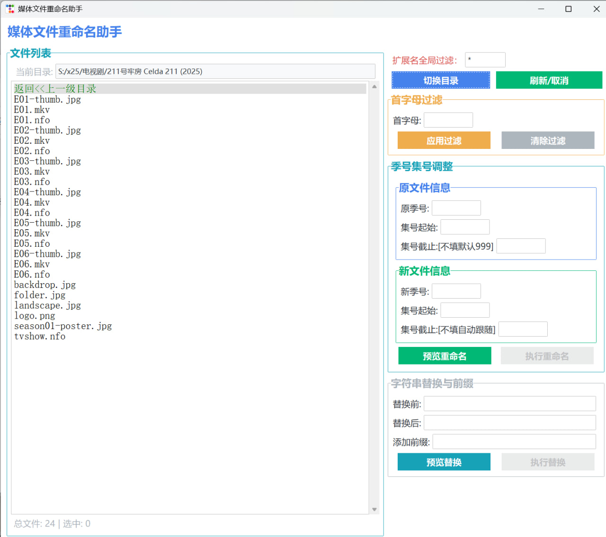

## episode_renamer——媒体文件重命名助手

https://t.me/duckduckcute/103)

### 功能进一步完善了下:
1. 全局扩展名过滤
2. 标准季集命名修改，符合包含SxxxExxx
3. 字符串替换，可同时进行前缀添加
4. 列出文件列表，点击单个文件项时（可多选） 应用自定义作用域
5. 列出文件列表，文件夹类型标记为黄色背景，不应用自定义作用域
6. 注册右键菜单，点击资源管理器文件夹和文件背景时，从当前路径打开程序
7. UI重构
8. 首字母过滤文件项
9. 目录位置记忆
10. 文件计数，选中计数
11. 替换修复包含空格

